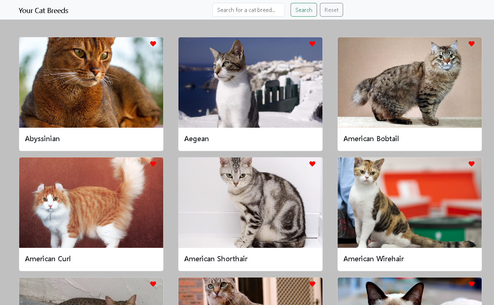

# Cat API Web Application

This is a simple web application that allows users to browse through a collection of cat breeds. It fetches data from an external API and displays the cats in a card format. Users can click on a cat card to view more details about the breed.

## Features

- Browse through a collection of cat breeds
- View detailed information about a specific cat breed
- Search for cat breeds by name
- Reset the search field and display all cats ( only limited to 9 cats on page)
- Favorite a cat breed (Note: This feature is currently under development)

## How to Run

1. Clone the repository to your local machine.
2. Open the `index.html` file in your browser.

## File Structure

- `index.js`: This is the main JavaScript file that handles fetching the data from the API, displaying the cats, and implementing the search functionality.
- `apifunctions.js`: This file contains the function for fetching the cat data from the API.

## Future Improvements

- Implement the functionality to favorite a cat breed.
- Store the favorited cat breeds in local storage so they persist across sessions.

## Contributing

Pull requests are welcome. For major changes, please open an issue first to discuss what you would like to change.

## Screenshot 

